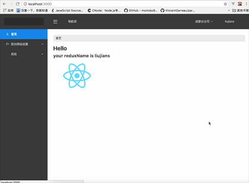

# typescript-react-demo-2017

吐槽：2017到了、typescript也发布2.4了、React-router也发布V4了、react也马上16.0.0了、在这样一个技术版本飞速迭代的时代。写个demo是很累的

## 简介

写这个项目的初衷是因为、网上的资料太少了、自己踩了很多坑、

整合typescript和react中遇到很多问题网上搜都没什么答案

大部分搜tslint得到的结果都是ng的、因为typescript在ng2中必不可少、所以ng上问ts的问题比较多

这里写一些基本的代码供大家参考

本项目是自己做练习的时候写的`demo`项目、用到的技术栈有：

- react
- react-router V4
- react-redux
- ant-design
- typescript

## 快速开始

下载此项目到本地、定位目录

> npm install

> npm start

## 打包和测试

> npm build

> npm test

## 关于项目

typescript 才发布2.4不久、所以有些ide的tslint插件会波浪线、但是其实编译可以过的

由于是demo、为了做练习、所以有些写法不太符合正常项目的设定

楼盘推荐的位置是通过父组件、管理三个子组件的状态（只是为了练习、这里没用redux）

目前redux只用到了共享用户信息

所以这里的楼盘推荐管理是没有用redux管理的

## 为什么要使用typescript?

facebook出过一款prop-types库、就是为了解决类型传入组件的问题

Reddit 工程师 Niranjan Ramadas已经做了分析、原文请点击[这里](https://redditblog.com/2017/06/30/why-we-chose-typescript/)

大意就是:

作者认为任何语言都有其优缺点，不过合适的语言应该具备如下特点：强类型、完备的工具链支持、能够用于生产环境等。作者还特地比较了 TypeScript 与 Flow(由facebook推出)，TypeScript 是能够编译到 JavaScript 的超集语言，而 Flow 则是提供了一系列额外的注解来实现类型系统。Flow 能够保证较好的类型覆盖，但是其对于多态性的支持并不是很好，并且 TypeScript 的社区也相对活跃。